# Sparsity Analysis Report 

## Intro 
We assess the sparsity structures of three different models: RoBERTa, GPT2, and BART. Scripts for the sparsification of these models at the given sparsities can be found in the create_sparse_models.py script, where we use a global unstructured pruning method (L1 Norm). We then evaluate these different models and their varying sparsities on two benchmark tasks within GLUE: MRPC, and SST2. 

SST2 -- or "Stanford Sentiment Treebank Classification" is a sentiment analysis task using excerpts from movie reviews as the data source. 

MRPC -- or "Microsoft Research Paraphrase Corpus" is a paraphrasing task where the model is given two sentences and asked whether one is a paraphrase of the other. 

(Details on these tasks and others in the GLUE benchmark can be found here: https://docs.google.com/spreadsheets/d/1BrOdjJgky7FfeiwC_VDURZuRPUFUAz_jfczPPT35P00/edit#gid=0)

As a note, I ended up skimping out on full blown 1B LLM's, as I only got my hands on the polaris machine very late, and my local machine could only handle moderately sized models. 

## Intial Parameter Analyses 
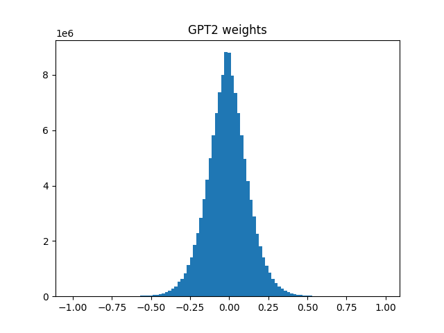

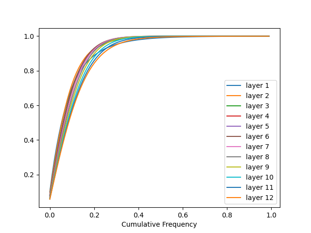

In the case of gpt2, we see that on the whole, the weights are evenly distributed mostly contained in the interval (-0.5,0.5), with most weights centered aroud 0 which is relatively expected. When looking at the layer by layer distributions, we see that while most layers follow similar behaviors, there are a few that in general have more weights of higher magnitude than others, in particular the layers that pop out the right side of the distribution such as layer 10. 

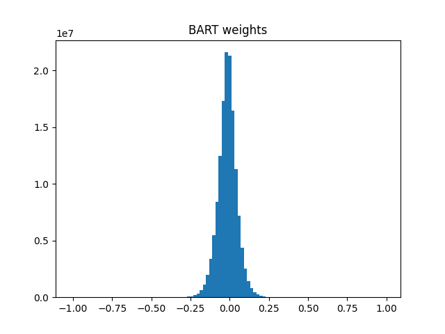

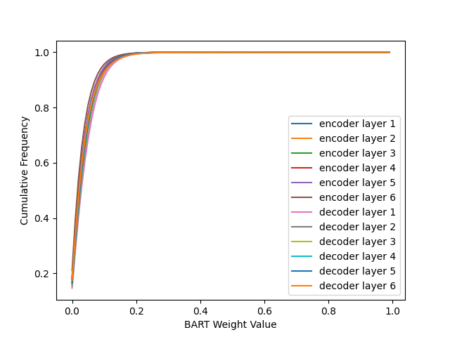

The BART distribution looks similar but is even more tightly packed around 0, this time with most weights contained in the interval (-0.25,0.25), and again bunched around 0 as expected. 

And again there do not seem to be large difference in the magnitudes of weights in a given layer, regardless of whether they are encoder or decoder layers. We do see that decoder layer one is most to the right of all the layers, suggesting it has a higher concentration of larger magnitude weights, but the difference looks to be relatively small from the other layers. 

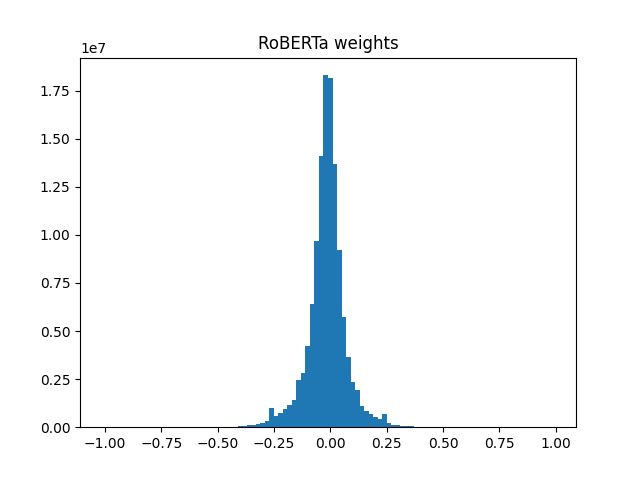

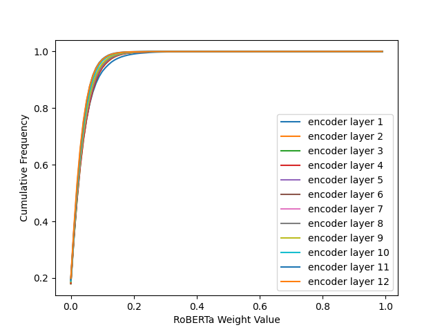

The roberta overall distribution is interesting, because we see small spikes in weights at around the -0.25 and .25 values, but outside of this it looks mostly like the BART distribution, just a bit more spread. 

When looking at the layer by layer distribution there does look to be an outlier layer in (what I assume) is layer 1, but again for the most part everything seems tightly packed together. 

## Task Results 

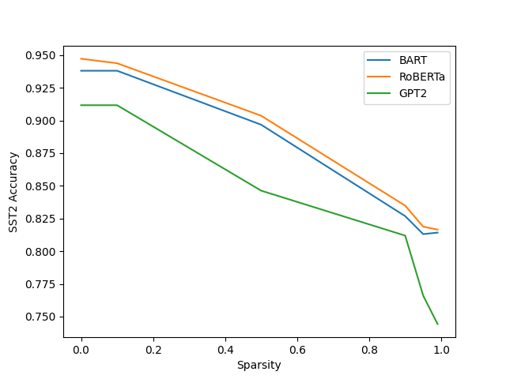

For the sst2 task we run each model for three epochs with the same learning rate. As seen from the results, the 0.1 sparsification makes next to no impact on the performance of the model, but there is a drop in each model going to the 0.5 sparsity, and then another drop going to the 0.9 sparsity. In the case of the BART and RoBERTa models, performance is similar for the 0.9, 0.95, and 0.99 specifications, while in the GPT2 case there are continued drops as we increase the sparsity. 

Due to the way the prune function and the prune.remove functionality work in pytorch, the actual size of the models when pruned did not change, as the weights were just zeroed out. I think that as a direct result of this the actual time it takes to both train and evaluate the model also changes very little. This may just be a case of implementation. 

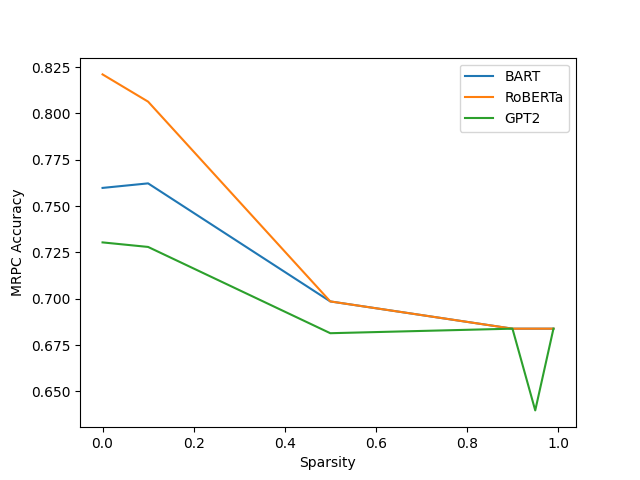

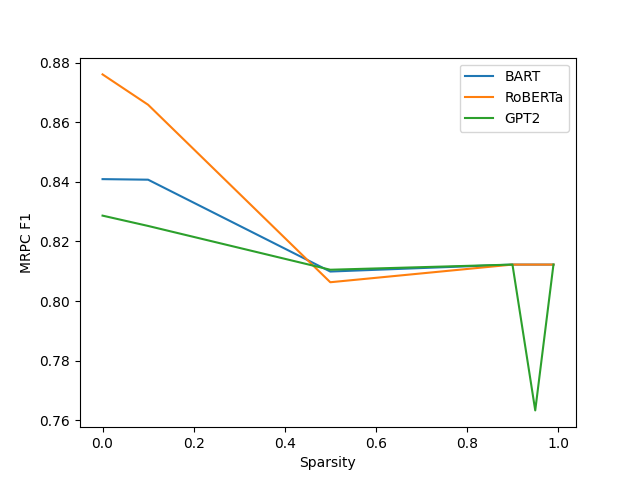

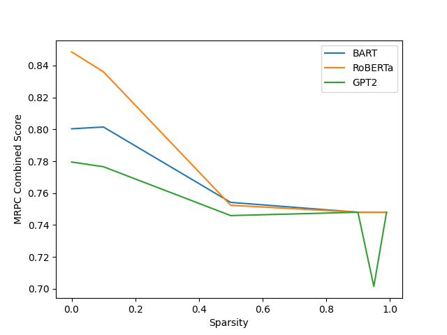

As seen in these three graphs, in the case of most of the 0.1 sparsities, there is little drop off, with roBERTa having the highest drop amongst the three models, which still results in just about 0.01 drop in combined score. All the three models demonstrate similar performance at the 0.5 and 0.9 sparsity levels, where 0.5 is around equal to 0.9 in all three metrics for the three models, where we see a bit of a drop off for all three models (RoBERTa having the highest drop off). Then interestingly we see that for GPT2 we have a dip at 0.95 and back up to 0.9 levels at the 0.99 sparsity. However we see in general that the performance also does not change much for the other models across the 0.9, 0.95, and 0.99 sparsities. And going from most dense to most sparse results in a 0.06 drop for roBERTa in combined score, 0.03 for BART, and 0.02 for GPT2. 

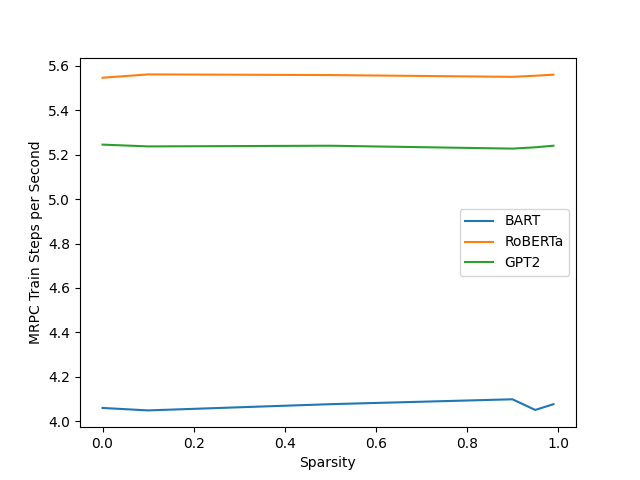

Once again we see very little differences in the train times for the models, again likely due to the same reasons as discussed above in the sst2 example. 

## Challenges of Sparsification in LLMS 

One immediate challenge that I saw was that in the pytorch implementation of the global unstructured prune, rather than getting rid of the weights in a way that they would be skipped during computation, in the current implementation the weights are just zeroed out, and the computation time benefit that we would hope to get out of sparsification is near non-existent, which is not ideal for at least parts of the problems that sparsification wants to solve. 

One other thing that I wonder about with sparsification in LLMS is the way that sparsifying different parts of the transformer architecture changes the performance of the model. On initial research, it seems magnitude based methods might not always be the way to go in LLMs, and that structured pruning to induce sparse patterns, like pruning out consecutive parameters, might increase model performance, but figuring out the optimal way to prune a given LLM may not be immediately clear, and the novelty of the architecture may play an especially large role in the methods used for pruning. 