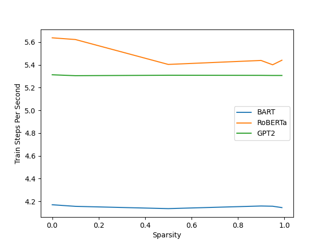

# Sparsity Analysis Report 

## Intro 
We assess the sparsity structures of three different models: RoBERTa, GPT2, and BART. Scripts for the sparsification of these models at the given sparsities can be found in the create_sparse_models.py script, where we use a global unstructured pruning method (L1 Norm). We then evaluate these different models and their varying sparsities on two benchmark tasks within GLUE: MRPC, and SST2. 

SST2 -- or "Stanford Sentiment Treebank Classification" is a sentiment analysis task using excerpts from movie reviews as the data source. 

MRPC -- or "Microsoft Research Paraphrase Corpus" is a paraphrasing task where the model is given two sentences and asked whether one is a paraphrase of the other. 

(Details on these tasks and others in the GLUE benchmark can be found here: https://docs.google.com/spreadsheets/d/1BrOdjJgky7FfeiwC_VDURZuRPUFUAz_jfczPPT35P00/edit#gid=0)

## Intial Parameter Analyses 

## Task Results 

For the sst2 task we run each model for three epochs with the same learning rate. As seen from the results, the 0.1 sparsification makes next to no impact on the performance of the model, but there is a drop in each model going to the 0.5 sparsity, and then another drop going to the 0.9 sparsity. In the case of the BART and RoBERTa models, performance is similar for the 0.9, 0.95, and 0.99 specifications, while in the GPT2 case there are continued drops as we increase the sparsity. 

Due to the way the prune function and the prune.remove functionality work in pytorch, the actual size of the models when pruned did not change, as the weights were just zeroed out. I think that as a direct result of this the actual time it takes to both train and evaluate the model also changes very little. This may just be a case of implementation. 

As seen in these three graphs, in the case of most of the 0.1 sparsities, there is little drop off, with roBERTa having the highest drop amongst the three models, which still results in just about 0.01 drop in combined score. All the three models demonstrate similar performance at the 0.5 and 0.9 sparsity levels, where 0.5 is around equal to 0.9 in all three metrics for the three models, where we see a bit of a drop off for all three models (RoBERTa having the highest drop off). Then interestingly we see that for GPT2 we have a dip at 0.95 and back up to 0.9 levels at the 0.99 sparsity. However we see in general that the performance also does not change much for the other models across the 0.9, 0.95, and 0.99 sparsities. And going from most dense to most sparse results in a 0.06 drop for roBERTa in combined score, 0.03 for BART, and 0.02 for GPT2. 

Once again we see very little differences in the train times for the models, again likely due to the same reasons as discussed above in the sst2 example. 

## Challenges of Sparsification 